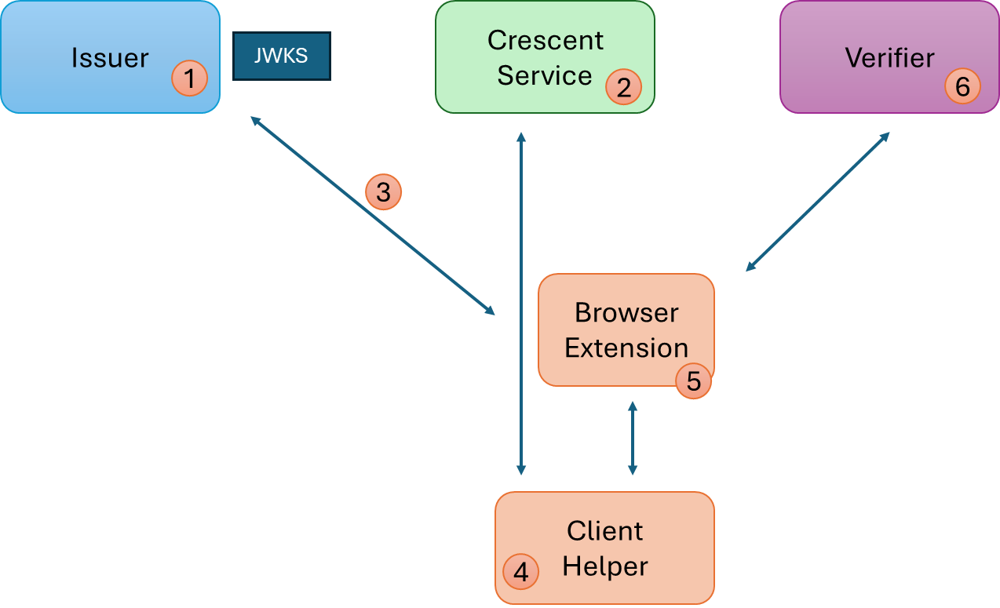
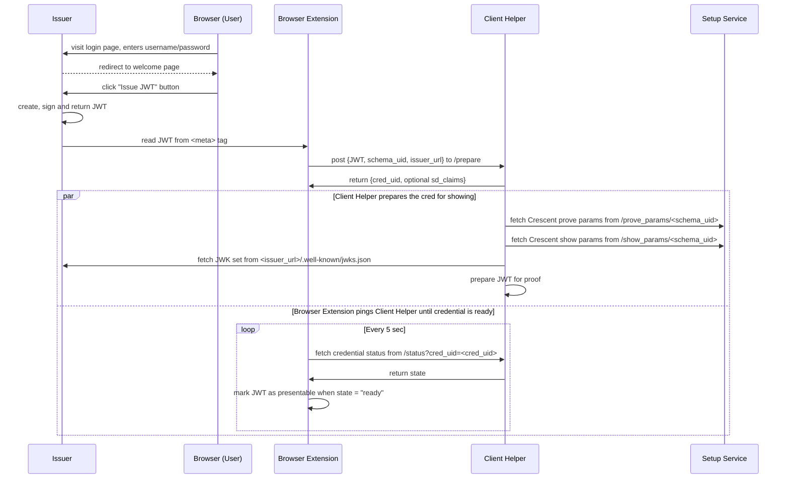
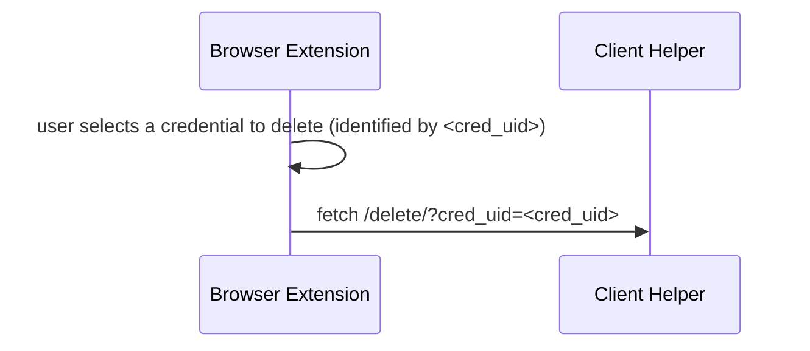
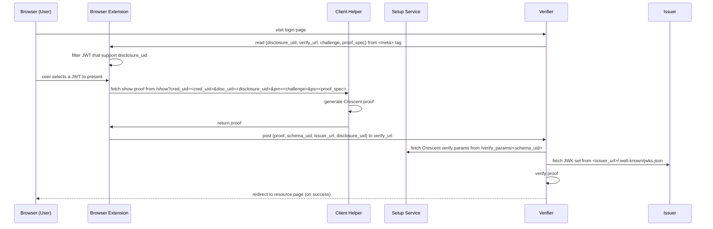

# Crescent Sample

This folder contains a sample setup service, issuer, client, and verifier making use of the Crescent system. Note that these components are for demonstration only; they should not be used in production environments.

The sample currently supports two credential types: JSON Web Tokens (JWT) and mobile Driver's License (mDL). The issuer can create fresh JWTs but mDLs (such as those generated by the [`mdl-gen.rs`](../circuit_setup/mdl-tools/src/bin/mdl-gen.rs) utility) must be imported manually in the client. 

The sample is composed of the following components:
* Issuer: a Rocket server that issues JWT tokens; see [`issuer/README.md`](./issuer/README.md).
* Setup Service: a Rocket server that sets up the ZK parameters for all issuers using the same JWT/mDL schema and cryptographic algorithms; see [setup_service/README.md](./setup_service/README.md).
* Client: a browser extension that stores JWT tokens and presents ZK proofs; see [`client/README.md`](./client/README.md).
* Client Helper: a Rocket server that assists the Client; see [client_helper/README.md](./client_helper/README.md).
* Verifier: a web application that verifies ZK proofs; see [`verifier/README.md`](./verifier/README.md).

Two scripts help with managing the sample projects:
* `./setup-sample.sh`: runs the setup script for (using a default config) and builds the `issuer`, `client_helper`, and `verifier` projects; each must then be started in their own console with `cargo run --release`. The client must be setup and installed separately. 
* `./clean-sample.sh [--data-and-build]`: cleans the data (if the build files too, if the `--data-and-build` flag is passed) for the `issuer`, `client_helper`, and `verifier` projects.

Each component must be setup and modified individually; see their respective README for details. Once setup, follow the instructions from <a href="sample.html">this page</a> to go through the sample demo steps.

## Docker

The sample can be built and run in a docker container without having to install Rust or the project dependencies.
The docker build copies the project source code from this directory, so any changes made to the source code will be reflected in the image.

```bash
# From the root of the project, build the image
docker build -f sample/Dockerfile -t crescent-sample .

# Start a container from the image
# The browser extension files will be available in the `crescent-extension` folder created in the current directory

# Linux
docker run -v "$(pwd)/crescent-extension:/extension" -p 8001:8001 -p 8003:8003 -p 8004:8004 crescent-sample

# Windows (Cmd)
docker run -v "%cd%\crescent-extension:/extension" -p 8001:8001 -p 8003:8003 -p 8004:8004 crescent-sample

# Windows (Git Bash)
docker run -v "$(pwd -W)\crescent-extension:/extension" -p 8001:8001 -p 8003:8003 -p 8004:8004 crescent-sample
```

When the container is started, the following services will be available:
* Issuer: http://localhost:8001
* Client Helper: http://localhost:8004
* Verifier: http://localhost:8002

Install the browser extension from the `crescent-extension` folder created in the current directory. See the [client README](./client/README.md#installation) for instructions on how to install the extension.

# Sample Overview

The sample application illustrates the setup of a Crescent system, and the proof generation and verification from a standard JWT or mDL, mimicking a real-life scenario. Note that security aspects have been overly simplified (e.g., using HTTP over localhost instead of HTTPS, simple username/password user authentication, etc.).

The sample lifecycle is described below, the numeral steps reference this diagram.



The *Issuer* is an "unmodified" conventional JWT issuer (we don't have a mDL issuer, as these are not typically issued from web endpoints). It generates a RSA key pair and publishes the public key in a JSON Web Key set at its `.well-known/jwks.json` location. It offers a login and token issuance page (the sample offers two demo users, "alice" and "bob", sharing a password "password"). For device-bound credentials, we assume that users have long-lived key pairs registered out-of-band with the issuer; freshly-generated keys could easily be used instead by adding modifying the issuance flow.

The *Setup Service* sets up the Crescent parameters. These parameters, identified by a schema UID, can be shared by all *Issuers* using the same signing algorithm, and the same credential type and schema. The Setup Service calls the `zksetup` library function using an existing JWT or by creating one using dummy claim and signature values. The resulting parameters are made available at a public endpoint.

To obtain a JWT, Alice visits the Issuer welcome page using a browser with the *Browser Extension* installed and the *Client Helper* running. She logs in using her username and password, and clicks "Issue" to get issued a JWT. The browser extension reads the JWT from the HTML page and sends it to the Client Helper which 1) retrieves the corresponding Crescent parameters from the Setup Service, and 2) runs the `prove` library function preparing the JWT for later showing. The proving parameters are stored in the Client Helper and associated with the JWT. A mDL can be loaded directly into the Browser Extension, in absence of a sample issuance workflow; the same preparation steps are performed by the Client Helper.

Later, Alice visits a *Verifier* page. Her browser extension detects a meta tag indicating a Crescent proof request requesting a specific disclosure UID (see below), and specifying a random session ID value (the challenge) to be signed by the client as the presentation message, to prevent replay attacks. She opens the extensions and selects the credential to use (matching the requesting type (JWT or mDL) and disclosure capabilities). The Client then generates a showing by calling the `show` library function and sends it to the Verifier endpoint specified in a meta tag. Upon reception, the Verifier downloads the validation parameters from the Setup Service (the first time it sees a presentation for the schema UID) and, for JWTs, the Issuer's public key (the first time it sees credential from this Issuer), and calls the `verify` library function. Upon successful proof validation, Alice is granted access. 

# Sample details

The sample defines the following *schema UIDs* expressing the credential type and proof capabilities.

### jwt_corporate_1

* Description: a JWT following the schema used in corporate systems (e.g., Microsoft Entra)
* Credential type: JWT
* Supported disclosure UIDs:
  * `crescent://email_domain`: reveal the domain of an email claim

### jwt_sd

* Description: a JWT supporting selective disclosure of its encoded claims, and device key binding
* Credential type: JWT
* Supported disclosure UIDs:
  * `crescent://selective_disclosure`: supports the selective disclosure of the credential's claims

### mdl_1
* Description: a mobile Driver's License
* Credential type: mDL
* Supported disclosure UIDs
  * `crescent://age_over_18`: reveal that an encoded date of birth makes the user older than 18 years old

## Credential issuance

The following diagram illustrates the credential issuance sequence.



## Credential deletion

The following diagram illustrates the the credential deletion sequence.




## Proof presentation

The following diagram illustrates the proof presentation sequence.



